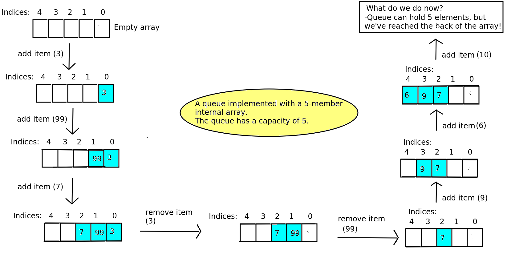
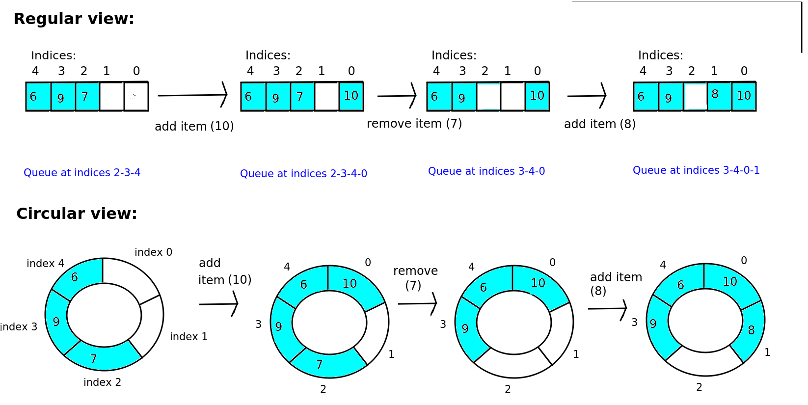

# Topic 4 - Queues

This week we are going to look at a further data structure, the *queue*.

## Introduction

We have seen that a stack is a "last-in-first-out", or LIFO, data structure -
in other words, the last item added (pushed) to the stack is the first item
to be removed (popped). However, in certain circumstances it is more
appropriate to use a "first-in-first-out", or FIFO, data structure.
Luckily such a data structure exists, and that is the *queue*, so called 
because it behaves like a real-world queue. Items get added onto the back 
of the queue, and are removed from the front of the queue.

When would we use a queue? It would be used in any situation where we want
to process tasks - or "jobs", in the order that they are submitted. There
are many scenarios wheere we would like to do this. For example:

- a printer queue. When we send something to be printed, the software on
the printer would add it to the back of its queue. The printer "jobs" at
the front of the queue would be processed first, and then the other "jobs"
would move forward when the current "job" has finished printing.

- websites which need to do pre-processing of data that users have submitted. An example here would be a website which allows users to share photos. Submitted photos would need to be checked, to make sure they are suitable, and perhaps altered. For example, faces and car license plates should be blurred for privacy reasons and to comply with the GDPR, and offensive material should be removed. Many users may be submitting photos all the time. Multiple photos cannot be checked in parallel at the same time, as the techniques used to detect objects in photos use a lot of memory - so the machine would quickly run out of memory and the website would stop functioning. Therefore, a queue is a better and more memory-efficient solution, as it allows processing of one photo at a time in the order the photos were submitted. In other words, when a new photo is submitted, it's added to the back of the queue, and the pre-processing software checks each photo in the queue in turn, starting with the first. 


## Implementing a queue

How might we implement a queue? Let's start by going back to how we implemented a stack, using an underlying array. Can we do the same with a queue? The
diagram below demonstrates this.



Note how the queue is implemented in this example using an internal array with
a capacity of 5. When we add an item, the item is added to the first avaiable
position in the internal array. So if the queue is empty, the item is added
to position 0 of the array. (**Note how I have reversed the array so that
index 0 is on the right and index 4 on the left. This is so that the diagram
better reflects a real-world queue, with new items added to the back**).

So the first item - 3 - is added to the internal array at index 0. We then
add another item - 99 - which is added to the back of the queue, in other
words added to the internal array at index 1. Similarly, the next item - 7 - 
is added to the internal array at index 2.

As a consequence of this, we will **need a variable to represent the index in the internal array of the back of the queue**, so we know where to add elements. This variable will be 0 when the queue is empty, 1 after we have added 3, and 2 after we have added 99. In other words it is the index **one position beyond the back of the queue**. Can you see **why** it's better to point to the position beyond the back of the queue, rather than the back of the queue itself?

What happens, though, when we *remove* an item? This happens next - we
remove the front item on the queue (3). This results in *position 0
of the internal array becoming empty* so that the remaining queue - 99 and 7 -
starts at *index 1 of the array* and not index 0. This illustrates a key
point. **Because of the first-in-first-out nature of a queue, the queue is
not always stored beginning at index 0 in the internal array.** The 
queue can "shift" down the array, as has happened here; when we remove 3,
the remaining items - 99 and 7 - are at indices *1 and 2* of the array.
This is done because it is more efficient. If we wanted to ensure the queue
always started at index 0 in the internal array, we'd have to do some
wasteful additional processing to move 99 to index 0 in the internal array
and move 7 to index 1. By letting the queue "shift" down the array in the
manner shown in the diagram, we avoid the need for this additional processing.

The consequence of this in terms of implementation, though, is that **we will
need another variable to represent the index in the internal array where the queue starts**, so that we can remove the correct item from the queue. 
(This is originally 0, but when we remove 3 from the queue it will change to 1.). 

We then remove 99 from the queue, and consequently the queue shifts back one
more place so that the start of the queue is at index 2. At this point, the
queue will only store one item - 7 - so the start and the end of the queue
both have index 2 in the internal array.

We then start adding items again. First we add 9, so that the queue occupies
indices 2 and 3 of the internal array. Then we add 6, so that the queue 
occupies indices 2, 3, and 4.

What happens now, though, if we want to add a new item? We'd like to add
a new member - 10 - which we should be able to do as our queue has a capacity
of 5. However we have a problem because *we've reached the end of the internal
array*. So we need to do something else.

The diagram below shows a common approach, which is to implement a **circular array**. When we reach the back of the array, we start adding items to the *front* again. So if our queue occupies indices 2, 3 and 4, and we wish to add a fourth item, this will be added at *index 0* of the array. So the queue will now occupy indices 2,3,4 and 0 - in that order. If you try to visualise the array as having a circular rather than linear structure, this is probably easier to 
understand. This is also shown on the diagram.



This shows how we add the fourth item (10) to index 0 as explained above, so
that the queue occupies the array indices 2, 3, 4 and 0 in that order. Then
we remove the front item of the queue, which is now 7, at index 2. *Make
sure you don't get confused here into thinking that the item at index 0,
i.e. 10, is at the front of the queue! It is not - the queue wraps around.
The front of the queue is at index 2, then the next member is at index 3,
then the next at index 4, and the BACK of the queue is at index 0*!

After removing 7, the front item of the queue is now 9, at index 3 in the
array, so the queue occupies indices 3, 4, and 0 - with index 0 still at the
back. So if we add yet another item - 8 - to the queue, it will be added
at the next available space at the back of the queue, which is *index 1*
in the array, due to the wrap-around effect.

The top of this diagram shows the queue in a regular, linear view whereas
the bottom of the diagram shows the same operations using a *circular* view
of the array, in which the array is represented as a circle from indices 
0 to 4 and then back to 0. Note that this is just a *diagrammatic representation* to make the concept of a circular, wrap-around array easier to understand. *The array is not actually stored in a circular way in memory!!!*

## Exercise 1 - Paper

Exercise 1 is a "paper" exercise to help you
understand the operations of a queue. Code is not needed for this. However
please complete it electronically (e.g. on a text editor, Word, or Microsoft
Paint) as it will be easier for me to check.

Start with an empty circular queue, represented internally by an array with 
capacity 8, and perform the following
operations on it. After each operation, draw how the queue is represented
by showing the internal array and the queue within it.

Note that `size()` should give the *size of the queue itself*, not the
capacity of the underlying array.

```
add (a), add (b), remove (), add (c), remove (), remove (), 
add (d), add (e), add (f), remove (), add (g), add (h), 
remove (), remove (), remove (), add (i), remove (), size().
```

## Exercise 2 - Coding

Try creating a `Queue` class to represent a queue. Like your `Stack` class
this should contain an internal array. As we discussed above, *we also need
two attributes to represent the front and the back of the
queue*, because the queue shifts position within the internal array.

You will also need a third attribute to represent the queue's capacity
(the number of items it can hold).

Your `Queue` class should have two methods, `add()`, which should add an item
onto the queue, and `remove()`, which should remove - and return - an item
from the queue.

Also give your class a `__str__()` method, so that you can easily print your
queue to see what its internal state is. This should return the result of
the `__str__()` method of the internal array (so you can see what is stored 
in the array) and *also* the values of the front and back attributes.

How can you efficiently implement the circular aspect, so that the front and
back variables "wrap round" after reaching the end of the array?
