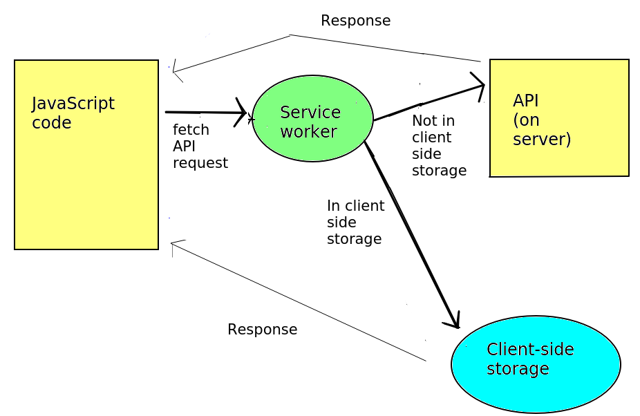
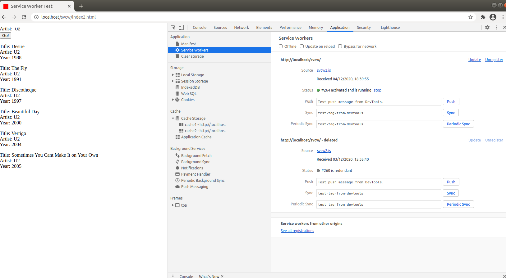
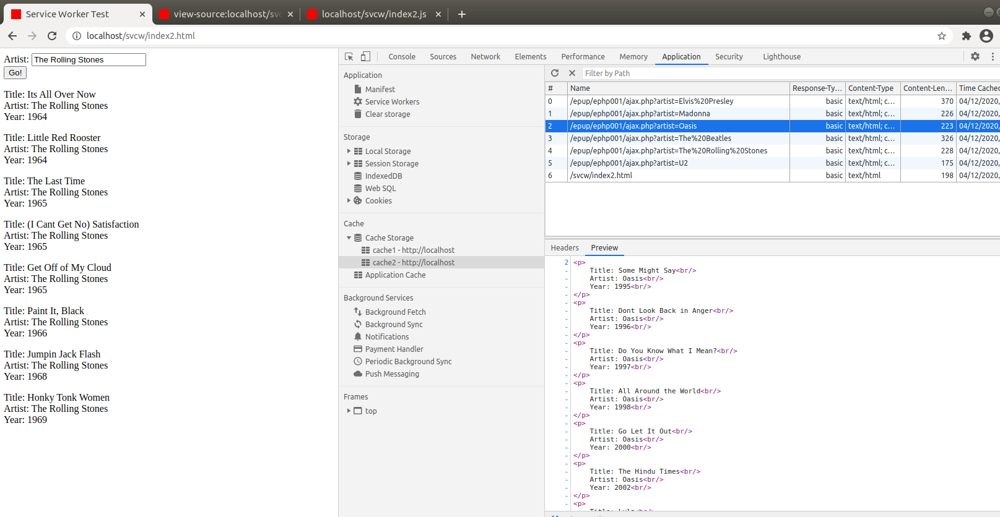

# Week 9 : Offline Web Applications

## Introduction

Often, we might want to use a web application without an internet connection. This is particularly useful in the case of an outdoors augmented reality application, in which we might be in the forest or the mountains and have no internet connection available. In these sorts of cases, it would be good to use an *offline*, cached version of the data rather than having to make a request to a web API. Recently, technologies for allowing offline use of web applications have become available, notably *service workers*, together with offline sdata storage such as *IndexedDB*. A *progressive web application* is a web app which works in a similar way to a native app, in other words it can be installed with an icon, and works effectively offline. Progressive web applications, or PWAs, use these technologies to enable this functionality.

## This topic and the assignment

You will notice that the assignment makes no *explicit* reference to the technologies included here, such as service workers or PWAs. However, you will notice that the marking criteria expect a more advanced solution from Grade C upwards; you will only get a Grade D for implementing the assignment as stated in the brief and nothing more. Using service workers and making your app a PWA is one way to create a more advanced application and increasing your grade.

## Service workers

The first topic we will look at is *service workers*. A service worker acts as an "interface" between the client-side web application and a data source, such as a web API or an offline data source such as IndexedDB. The service worker intercepts HTTP requests to online resources, and loads an offline copy if one is available. The service worker does not perform the actual caching of data - that is done by other technologies such as IndexedDB - but rather it handles the logic of intercepting HTTP requests to load local copies of the data supplied by the URL being requested if there is a local copy available.

The diagram below shows the general operation of a service worker.



### Service workers are written in their own file

Service workers are written in their *own file*, separate from the main web application. The main web application communicates with the service worker when needed.

### Communicating with the service worker

To communicate with a service worker from the main application we would code such as that below:

```
if('serviceWorker' in navigator) {
    navigator.serviceWorker.register('/myapp/svcw.js')
        .then(registration => {
            console.log('Registered successfully.');
        })
        .catch(e => {
            console.error(`Service worker registration failed: ${e}`);
        });    
} else {
    alert('Sorry, offline functionality not available, please update your browser!');
}
```

What is this doing?
- First we check whether the service worker API is available.
- Next we *register* the service worker, specifying the URL of the service worker script. This is relative to the document root on the server, so `/myapp/svcw.js` would be expected to be in the `myapp` folder within the document root. 
- Registering the service worker returns a promise, so we specify a function with `then()` to run when the promise resolves (i.e. when registration has completed).
- We display an appropriate message in the console depending on whether the registration process was successful or not.

### The service worker itself

Moving on to the actual service worker. First of all, note that service workers have a *lifecycle*, and different *events* are fired at different stages of the lifecycle:
- They are first *installed*. This occurs after they are registered by the main application. Installation completes once the specified URLs have been cached.
- The site is then in a *waiting* state ([Google documentation](https://developers.google.com/web/fundamentals/primers/service-workers)).
An important point about service workers is that *if changes are made to the code for the service worker and the service worker is already running in another tab or window, the service worker will only be reloaded once this tab or window has been closed*. Until this happens, the service worker is in a waiting state.
- Once this is done, the updated service worker now "controls" the page and is considered *activated*.
- Once activated, the service worker can intercept requests made by the `fetch` API.

Here is some complete code for a service worker:
```
const CACHE_NAME = 'cache1';
const urlsToCache = [
    'index.html',
    'js/bundle.js',
    'css/webapp.css'
];

self.addEventListener('install', ev=> {

    console.log('Installed the service worker...');
    ev.waitUntil(
        const cacheOpened =  caches.open(CACHE_NAME)
                .then(cache=> {
                    return cache.addAll(urlsToCache);
                })
    );
});

self.addEventListener('activate', ev=> {
    // Force service worker to "take over" your page immediately, rather than
    // on reload
    console.log('Claiming control...');
    return self.clients.claim();
});

self.addEventListener('fetch', ev=> {

    console.log(`Service worker intercepted request for: ${ev.request.url}`);

    // Is the response from this URL in the cache?  (promise-based code)
    ev.respondWith(
         caches.match(ev.request)
            .then(res=> {
                
                // The promise will resolve with the cached response
                if(res) {
                    // Return it
                    console.log('This is in the cache');
                    return res;
                }
    
                // Otherwise, use the fetch API to send a request to the URL
                // and return it.
                console.log('This is NOT in the cache - fetching from web');
                return fetch(ev.request);
            })
    );
});
```
How is this working?
- The service worker is in its own file. Note that to reference the service worker object itself, you need to use `self` rather than `this`.
- Note how we create an array of URLs to cache. We might want to cache some URLs (particularly pages that do not update very often) but not others (URLs which provide data which frequently changes).
- Note that in this example we use the simple browser [Cache API] (https://developer.mozilla.org/en-US/docs/Web/API/Cache). This is a simple cache that can be used to store responses from URLs. However you can use any offline storage mechanism with a service worker, such as IndexedDB (we will look at this next week). The Cache API cache can be inspected in the developer tools of your browser.
- We then handle various *events* generated by the service worker. Firstly the `install` event which occurs when the service worker has been installed. Installation occurs after the service worker has been registered. We open the cache and then add all the specified URLs that we want to cache to it. This is an asynchronous operation so will return a promise. The `waitUntil()` call waits until this promise has been resolved, i.e. the caching operation has taken place. See [the Mozilla Docs](https://developer.mozilla.org/en-US/docs/Web/API/ExtendableEvent/waitUntil).
- The next step in the lifecycle of a service worker, after installation, is *activation*. This is relevant when you need to update the code in a service worker; the service worker will not be activated until all windows or tabs using the old version of the service worker have been closed. When activated, an `activate` event will be fired.
- Note how we have provided an event handler for `activate`. This event handler calls `self.clients.claim()`. What does this do? One important, and at first confusing, point about service workers is that by default, they will only intercept requests from a page *after it has been reloaded*, not on the initial first load. This is generally OK in a real-world application in which the service worker does not change very often, but is confusing when you are first experimenting with service workers as you will wonder why the service worker is not intercepting your requests immediately. `self.clients.claim()` forces the service worker to "take over" your page immediately, as soon as it's loaded, rather than waiting for a page refresh.
- The `fetch` event will occur when we fetch a URL using the `fetch` API. This is the actual interception operation performed by the service worker. The event handler object `ev` has a `request` property representing the HTTP request being carried out. We check this is a request for a URL in our cache. If it is, we return the corresponding response from the cache. If it isn't, we have intercepted a request for a URL we do *not* want to cache. So we make a web request using the `fetch` API, as we normally would.
- Note that the whole block of code to check the cache and make a `fetch()` request if necessary, is enclosed within a `respondWith()` call. `respondWith()` is described [on Mozilla](https://developer.mozilla.org/en-US/docs/Web/API/FetchEvent/respondWith) and, according to these docs, "prevents the browser's default fetch handling, and allows you to provide a promise for a `Response` yourself". In other words, we are responding with the result of our code (passed in as an argument to `respondWith()`) which fetches a response from the cache or from the web, overriding the default behaviour of `fetch()` which is to simply request the data from the web.


### Promise return values

Note how we *return values from a function that runs when a promise completes*
for example:
```
 caches.match(ev.request)
    .then(res=> {
        
        // The promise will resolve with the cached response
        if(res) {
            // Return it
            return res;
        }
    
        // Otherwise, use the fetch API to send a request to the URL
        // and return it.
        return fetch(ev.request);
    })
```
When the promise returned from `caches.match()`, resolves, the arrow function
specified as the argument to `then()` will run. Note how we *return a value* (either the response from the cache or the response from `fetch()`) from this arrow function. The value returned will become the overall return value of the promise chain `caches.match(...).then(...)`. In other words, the return value of the `caches.match(...).then(...)` chain will be either the response from the cache or the response from the web.

This return value is then passed to `ev.respondWith()`, thus overriding the default behaviour of `fetch()`.

### Extending the example - caching web API URLs

The previous example is fine if you just want to cache URLs that do not have query string parameters. However, in many cases, such as downloading points of interest from our AR web API, the exact URL will depend on the query string parameters, such as the `x`, `y` and `z` tile coordinates of our web API. So the URLs
```
hikar.org/api.php?x=4079&y=2740&z=13
hikar.org/api.php?x=4080&y=2740&z=13
hikar.org/api.php?x=4079&y=2741&z=13
```
would all be different, and if you cache one, the others would *not* be cached.
We cannot perform pattern-matching (e.g. regular expressions) in our list of URLs to cache, so have to do this manually.

Here is an example of a service worker that will do this:
```
const CACHE_NAME = 'cache1';
const urlsToCache = [
    'index.html',
    'js/bundle.js',
    'css/webapp.css'
];

self.addEventListener('install', ev=> {

    console.log('Installed the service worker...');
    ev.waitUntil(
        caches.open(CACHE_NAME)
            .then(cache=> {
                console.log(`Opened cache ${cache}`);
                return cache.addAll(urlsToCache);
            })
    );
});

self.addEventListener('activate', ev=> {
    // Force service worker to "take over" your page immediately, rather than
    // on reload
    console.log('Claiming control...');
    return self.clients.claim();
});

self.addEventListener('fetch', ev=> {
    console.log(`Service worker intercepted: ${ev.request.url}`);
    const url = new URL(ev.request.url);

    ev.respondWith(
        caches.match(ev.request).then(res=> {
            if(res) {
                return res;
            }

            // If it's not in the cache, check the URL
            if(ev.request.url.indexOf("/api/getdata.php") != -1) {
                // If it's a web API URL, fetch the response AND cache it
                return fetch(ev.request)
                    .then(res2 => {
                        console.log("Caching as matches pattern");
                        return caches.open(CACHE_NAME)
                            .then(cache => {
                                cache.put(ev.request, res2.clone());
                                return res2;
                            });
                    });
            // If not, simply fetch the response
            } else {
                return fetch(ev.request);
            }
        });
    )
});

```
How is this working?
- If the request is *not* in the cache, we check whether the request URL contains the string `/api/getdata.php` (imagine that this is our web API).
- If it does, we run a `fetch` request on the URL, and once we get a response, we open the cache again and add a *clone* of the response to the cache. It has to be a clone, as we also want to return the response to the user as a normal HTTP response.
- If it does not, we just do a simple `fetch` request, as before.

## Managing service workers from the browser

In the browser developer tools, you can manage service workers and the Cache API (this can be done in the *Application* tab in Chrome, for example). For example, the screenshot below shows how you can access your service workers (and unregister an existing service worker - useful if you have made changes to its code) in Chrome.


This shows how you can access the browser cache, again via the Application tab on Chrome. You can inspect and delete entries in the cache.



## Further reading

The following articles contain more information about service workers:

- [Google: Service Workers: an introduction](https://developers.google.com/web/fundamentals/primers/service-workers)
- [Mozilla: Using Service Workers](https://developer.mozilla.org/en-US/docs/Web/API/Service_Worker_API/Using_Service_Workers)
- [Rich Harris: Stuff I wish I'd known sooner about service workers](https://gist.github.com/Rich-Harris/fd6c3c73e6e707e312d7c5d7d0f3b2f9)
- [Mozilla: Making PWAs work offline with Service workers](https://developer.mozilla.org/en-US/docs/Web/Progressive_web_apps/Offline_Service_workers)

## Exercise 1

At [https://hikar.org/course/imm/songs.php](https://hikar.org/course/imm/songs.php?artist=Oasis) is a web API which provides JSON describing all songs by a
given artist. **You have to supply the artist as an `artist` query string parameter - the link includes a query string to search for all songs by Oasis but you can change that.**. Write an application which allows users to search for all songs by a given artist, so that the JSON is parsed and displayed within a `<div>`.
There should be a simple CSS file as well as the HTML.

You should use a service worker:

- initially, just cache your HTML and CSS pages
- then, cache all requests to your API.

## Progressive Web Applications (PWAs)

A progressive web application, or PWA, is a web application which acts like a native application. In other words, it can be run, not only via a URL in the browser, but also via an icon on your device's home screen. It also should work offline to be a true PWA; PWAs make use of service workers and offline storage to enable this. The first time a user visits the URL for a PWA, they will be prompted to install it to their home screen; alternatively, they can do this manually by selecting an option on the browser's menu.

PWAs have a number of core requirements:
- they must work offline, by means of a service worker; in fact Chrome on Android will only consider it a true PWA if it has a service worker and will not offer to install it to the user's home screen if not.
- they must be hosted with HTTPS, for security reasons. If you use GitHub Pages, this requirement will be satisfied.
- they must have a *manifest* file, which informs the browser about the application when first visited, and how to process the app. The manifest will let the browser know which is the main page of the app, and which icons it should use to display on the home screen. 

By covering service workers, we have already covered the hardest part of creating a PWA. The only remaining topic to cover is the creation of the *manifest*. This is a JSON file, using a format known as *webmanifest*, an example of which is given below. It would be saved with a `.webmanifest` file extension.
```
{
    "name": "Hikar Webapp",
    "short_name": "hikarweb",
    "description": "The Hikar Web App, developed using AR.js and A-Frame.",
    "icons": [
        {
            "src": "icons/hikar_web_192.png",
            "sizes": "192x192",
            "type": "image/png"
        },
        {
            "src": "icons/hikar_web_512.png",
            "sizes": "512x512",
            "type": "image/png"
        }
    ],
    "start_url": "/webapp/index.html",
    "display":  "fullscreen",
    "theme_color" : "#87CEEB",
    "background_color": "#87CEEB"
}
```
To link it to your web page, use a `<link>` tag:
```
<link rel='manifest' href='hikar.webmanifest' />
```

Much of this is quite easy to understand. We give it a `name` (the name that will appear on the splash screen when the app is launched), a `short_name` (the name as it will appear on your device under the app icon) and a description. We then specify an array of `icons` for different resolutions. It is recommended to create a 512x512 icon (which will appear on the splash screen when loading the app) and a 192x192 icon (which will appear on the device's home screen).

We then specify a `start_url` which is the initial HTML page of the PWA. The `display` property can be used to enable fullscreen, making the PWA appear even more like a native app (no URL bar can be seen). The `theme_color` is used to set the theme of the app (navigation bar colour, etc) while the `background_color` is the background colour of your splash screen.

Interestingly PWAs also work in some cases on desktops and laptops: again if you select the appropriate option from the menu you can install the PWA to your desktop, and run it by clicking on its icon.

For more detail on creating PWAs, see this [Mozilla article](https://developer.mozilla.org/en-US/docs/Web/Progressive_web_apps)

### Checking your PWA - Lighthouse

Chrome comes with a tool *Lighthouse* which allows you to audit your PWA before releaing it. Lighthouse, available under the Developer Tools, performs checks such as:

- does the main page of the app still load if accessing offline?
- does it have a service worker?
- is HTTPS used (or is it running on localhost)?

Lighthouse will tell you which of these checks pass and which do not. If they do, then it is a standards compliant PWA and will be installable on a PWA-supporting browser. 


### Exercise 2

Turn your application from Exercise 1 into a full PWA, installable onto your home screen or desktop. You will need to ensure you create an icon (at sizes 512x512 and 192x192) but this does not have to be particularly artistic.
